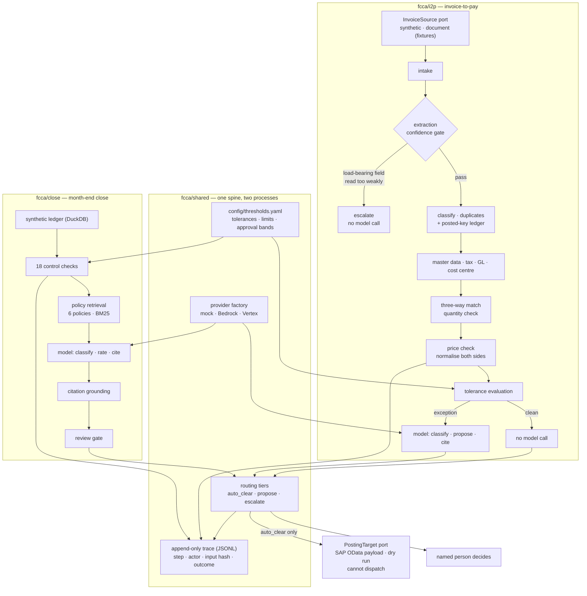

# Finance Control Agent

Two finance exception processes — month-end close and invoice-to-pay — built on one auditable spine.

**The data is synthetic. The ERP posting is simulated.** No real entity, vendor, invoice, bank account, employee
or amount appears anywhere in this repository, and no path in the code writes to a financial system. Where this
document says an invoice was "cleared", it means a decision was recorded and a trace written. Nothing was paid.

---

## Why this exists

Two finance processes have the same shape. Month-end close raises more exceptions than there are reviewer hours:
unsupported manual entries, late postings, reconciliation differences. Accounts payable raises more invoice
mismatches than there are AP clerk hours: missing goods receipts, price variances, suspected duplicates. In both,
most items are benign, a few are not, and the scarce resource is the attention of the people qualified to decide.

Both are therefore obvious candidates for automation and obviously dangerous ones, for the same reason: the failure
mode is not a bad summary, it is money out of the door against a document nobody checked.

This repository explores one question across both: **can a finance control workflow stay evidence-based, auditable,
and honest about where a language model is and is not involved?** The two modules exist to test whether the answer
generalises, or whether it was an artefact of one process.

## What it does

**Close (record-to-report).** For one close exception: 18 deterministic control checks over a synthetic ledger in
DuckDB, policy retrieval through LlamaIndex with document and section preserved, one model call returning a
validated Pydantic object, citation grounding against what was actually retrieved, and a deterministic review gate.
It recommends; a named person decides.

**Invoice-to-pay.** For one vendor invoice: thirteen deterministic steps ending in a three-way match — purchase
order, goods receipt, invoice — with price and quantity normalised before anything is compared. Records the rules
flag go to a model to classify, propose a resolution and cite evidence. Records the rules clear never reach a model
at all.

**Shared.** Configuration, the provider factory, the audit log, the routing tiers, and the append-only trace.

## The one rule everything else follows from

**No language model touches arithmetic, matching, or a tolerance decision.** Not as a guideline — as a structural
property. `src/fcca/i2p/checks.py` imports no provider and cannot call one. The model is handed numbers that have
already been computed, compared and thresholded, and it is asked only to classify, propose and cite. Its output is
a Pydantic object with closed vocabularies; there is no free-text field any downstream step reads.

A test asserts that every trace record from a full deterministic run is attributed to a rule, so the property is
checked rather than claimed.

## Architecture



The load-bearing idea is the boundary inside that diagram. Everything before a model call is deterministic and
reproducible. The model interprets facts it did not compute, against limits it did not choose, and its output is
constrained, grounded and gated on the way out.

## A worked example: a price variance, end to end

Invoice `INV-00166`, EUR 408,413.81, one line. This is the case the invoice-to-pay module exists for, so it is
worth following all the way through.

### The raw input

The purchase order and the invoice describe the same line and disagree about almost every printed number.

| | Purchase order `PO-4500134` | Invoice `INV-00166` |
|---|---|---|
| item | `DC-SRVC-REVC` (vendor's code for `MAT-200310`) | `DC-SRVC-REVC` |
| quantity | 206 BOX | 206 BOX |
| list price | **1,648.00** per BOX | **1,666.043095** per BOX |
| discounts | 2.4%, then 7.37%, then 3.43% | none |
| surcharge | none | none |

### What the naive comparison does

Subtract the printed unit prices:

```
1,666.043095 − 1,648.00 = +18.043095   →   +1.09%
```

**+1.09% is inside the configured 2% tolerance, so a naive three-way match passes this invoice.**

That is the failure this module is built to prevent, and it is worth being precise about the direction. The vendor
has quietly dropped a discount schedule and raised the list price slightly, so the printed difference looks like
rounding. It is not.

### What normalisation does

Both sides are reduced to a net price for one base unit, by the same function, in a fixed order — discounts in
sequence, price unit, per-unit surcharge, then unit-of-measure conversion. `MAT-200310` is stocked in PCE and this
line is priced in BOX of 4.

```
purchase order
  1,648.000000   list price per BOX
  1,608.448000   less 2.4%
  1,489.905382   less 7.37%
  1,438.801628   less 3.43%
    359.700407   ÷ 4 PCE per BOX          ← net price of one piece

invoice
  1,666.043095   list price per BOX
    416.510774   ÷ 4 PCE per BOX          ← net price of one piece

residual        +56.810367 per piece  (+15.79%)
base quantity   824 PCE
line residual   +46,811.74 EUR
tolerance       2.0% or 25.00            → outside both
```

The discounts are applied in sequence, not summed: 2.4 + 7.37 + 3.43 is 13.2, but the cascade leaves 87.30% of the
list price rather than 86.8%. Summing them would misprice the line by roughly 0.5% — itself a quarter of the
tolerance.

**The naive comparison would have cleared a EUR 46,811.74 overcharge as a 1.09% rounding difference.** The
normalised comparison reports it as +15.79%.

### The trace

```
$ fcca i2p-run --invoice INV-00166 --provider mock

step                   actor provenance                 outcome        summary
intake                 rule  I2P-S-01                   loaded         Received INV-00166 from V-10017, EUR 408,413.81, 1 line(s).
classification         rule  I2P-S-02                   MM             Classified as MM. At least one line references a purchase order.
duplicate_check        rule  I2P-S-03                   unique         No match among 22 earlier invoice(s) from this vendor.
master_data_resolution rule  I2P-S-04                   resolved       Resolved 1 of 1 supplier item number(s) to material master.
tax_code               rule  I2P-S-05                   resolved       Tax codes: line 1: V1.
gl_derivation          rule  I2P-S-06                   stated         GL account stated on every line.
cost_center_derivation rule  I2P-S-07                   resolved       Cost centre resolved on every line.
three_way_match        rule  I2P-S-08                   matched        Three-way match applicable to 1 line(s): purchase order, goods receipt and invoice.
quantity_check         rule  I2P-S-09                   computed       line 1: invoiced 824.000 of 824.000 available
price_check            rule  I2P-S-10                   computed       line 1: normalised 416.510774 vs 359.700407 (+15.79%), naive comparison would show +18.0431
tolerance_evaluation   rule  I2P-S-11                   breach         Price tolerance breached on line(s) [1].
routing_decision       rule  I2P-S-12                   escalate       1 finding(s); primary exception price_variance. Rules alone route to escalate.
exception_assessment   model deterministic-stub-v1@i2p-v1 price_variance Classified as price_variance; proposes block_for_price_review at confidence 0.88, citing 4 field(s).
routing_decision       rule  I2P-S-12                   escalate       Routed to escalate: Exception 'price_variance' is rated high severity.
```

Thirteen of the fourteen records are `rule`. One is `model`, and it appears only after the rules have already
decided there is an exception. Note the two `routing_decision` records: the first is the tier the rules alone
assigned, the second the tier after the model's confidence was added. Both are recorded so that what the model
changed is visible rather than asserted.

### The posting decision

`escalate`. Not because the model was unsure — it was 0.88 confident — but because a price variance of this
severity is reserved for a person by rule. A EUR 46,811.74 disagreement about price is a conversation with a
vendor, not a checkbox.

Nothing was posted. Nothing in this repository can post.

## The trace

The trace is the product, not a debug log. One record per pipeline step, append-only JSONL:

```json
{"timestamp":"2026-08-23T09:14:22Z","case_id":"INV-00166","module":"i2p","step_name":"price_check",
 "actor":"rule","input_hash":"2250afd4e39d2316","outcome":"computed","rule_id":"I2P-S-10",
 "model":null,"prompt_version":null,
 "summary":"line 1: normalised 416.510774 vs 359.700407 (+15.79%), naive comparison would show +18.0431",
 "detail":{"1":{"po_unit_price_normalised":359.700407,"residual_pct":15.793801,"line_residual_abs":46811.74}}}
```

Three properties are enforced rather than left to callers' discipline.

**Every record names its actor** — `rule`, `model` or `human` — and a validator refuses a record that claims one
actor while carrying another's provenance. A rule record must have a `rule_id` and must not have a model; a model
record must have both `model` and `prompt_version` and must not have a `rule_id`. A trace where computed and
inferred are indistinguishable is a transcript, not an audit trail.

**The writer is append-only.** There is no update method and no delete method, because a trace that can be tidied
up after the fact is evidence of nothing. Correcting a mistake means appending a record saying so. A test asserts
the mutation API does not exist.

**Computing and deciding are separate records.** `price_check` produces a residual; `tolerance_evaluation` decides
what the residual means against a configured limit. They can be wrong separately — one for an arithmetic reason,
one for a policy reason — so they are separate records.

```bash
fcca trace --case INV-00166 --module i2p
fcca trace --case EXC-0001
```

## Configuration is a control

Every tolerance, threshold and approval limit lives in [`config/thresholds.yaml`](config/thresholds.yaml), not in
Python. A tolerance is a business rule, and the controller or internal auditor who owns it should be able to read
the current value and propose a change without that being a code change.

The types and bounds stay in [`src/fcca/shared/config.py`](src/fcca/shared/config.py), because a YAML file will
happily accept a negative tolerance or a confidence of 4.0, and a bad edit should fail at start-up rather than
silently change what the system approves. Precedence is environment variable > `.env` > YAML > default, and the
values actually in force are recorded with every evaluation run.

## Routing

Three tiers, shared by both modules:

| tier | meaning |
|---|---|
| `auto_clear` | applied without a second pair of eyes — a **simulated** posting, never a write to a ledger |
| `propose_and_approve` | the system states what it would do; a named person approves or rejects |
| `escalate` | a person investigates; approval is not enough |

The tier is a function of four inputs in a fixed order of authority: the deterministic outcome, the document value,
the exception type, and **only then** the model's confidence. Confidence is the last input and it can only move a
case toward more scrutiny. A parametrised test walks confidence from 0.0 to 1.0 and asserts the tier never loosens;
another asserts that no confidence value makes an exception auto-clearable at any document value.

### One rule is hardcoded

**Bank-detail changes always escalate**, regardless of confidence, document value, or how clean the rest of the
invoice is. The reasoning is not about model quality.

A payment-redirection fraud is *designed* so that every other check passes. The goods really were delivered, the
price really is right, the purchase order really exists — the attacker's objective is that nothing else looks
wrong. So the signals a confidence score is built from are exactly the signals the attack arranges to look normal,
and a model that is 99% sure the invoice is fine is evidence that the fraud is working, not that the account is
right.

The control that catches this is a person telephoning the vendor on a number held independently of the invoice.
Software cannot perform or verify that, so the only defensible routing is to put it in front of someone who can —
every time, with no confidence threshold that bypasses it and no value floor beneath which it is skipped. It is
hardcoded rather than configurable because a configurable fraud control is one deployment mistake from being
switched off, and a test asserts there is no setting for it.

## Evaluation

### Invoice-to-pay

334 invoices, both MM (PO-based) and FI (non-PO), each generated from a named scenario whose expected outcome was
known before the engine saw it. Measured with the mock provider under the shipped configuration:

| | stub | Sonnet 4.5 (live, eu-central-1) |
|---|---|---|
| invoices | 334 | 334 |
| touchless rate (`auto_clear`) | **0.234** (78) | **0.234** (78) |
| `propose_and_approve` | 0.494 (165) | 0.494 (165) |
| `escalate` | 0.272 (91) | 0.272 (91) |
| **false auto-post count** | **0** | **0** |
| exact agreement with expected outcome | 1.000 | 1.000 |
| model calls | 114 — exactly the exception count | 114 |
| mean confidence | 0.845 | 0.925 |
| invoices citing evidence they were not given | 0 | **15** |
| wall clock | — | 9m44s |

| class | actual | rate | precision | recall |
|---|---|---|---|---|
| no_exception | 220 | 65.9% | 1.000 | 1.000 |
| missing_or_delayed_goods_receipt | 32 | 9.6% | 1.000 | 1.000 |
| price_variance | 24 | 7.2% | 1.000 | 1.000 |
| gl_account_missing | 16 | 4.8% | 1.000 | 1.000 |
| cost_center_missing | 16 | 4.8% | 1.000 | 1.000 |
| duplicate_invoice | 14 | 4.2% | 1.000 | 1.000 |
| bank_details_mismatch | 12 | 3.6% | 1.000 | 1.000 |
| quantity_variance | 0 | — | n/a | n/a |

**The last row is the one a live model produced and the stub could not.** In 15 of 114 assessments,
Sonnet cited an invoice field it had not been given. Those citations were stripped before the assessment
was used — the same control the close module applies to policy citations — so no routing decision rested
on them, and the routing is identical to the stub's down to the invoice: same tiers, same counts, same
zero false auto-posts. Classification was unaffected too.

That is worth stating plainly because an earlier version of this table reported the zero as a property of
the system. It was a property of the stub. A rule engine cites only what it was handed; a model
occasionally reaches for a field it expects to exist. The check that catches it is code, which is why the
count is reported rather than discovered.

The rate is now bounded rather than merely printed. `i2p.max_ungrounded_citation_rate` defaults to 25% of
the invoices that received a model call, and `fcca i2p-evaluate` exits nonzero above it. The denominator is
the assessed invoices rather than all 334, because a share of the whole dataset would fall on its own as
the exception mix thins and would hide a worsening model behind a quieter month. The limit is deliberately
not zero: the observed 13.2% is what a strong model does on a first run, and a gate that fails every run is
a gate somebody switches off. It sits separately from the false-auto-post gate, which has no acceptable
nonzero value, because one of these is money leaving the building and the other is a citation that was
deleted before anything read it.

**Reading it honestly.** Every class scoring 1.000 measures pipeline integrity, not difficulty. The labels are
derived from the same scenario definitions the generator works from, so this says the pipeline carries a known
population through correctly. It is not evidence about a real ledger, and a 1.000 obtained from a real AP
population would be a reason for suspicion rather than confidence. `quantity_variance` reads n/a because the engine
can raise it and the specified scenario set does not seed it: an absence, not a failure.

The **false auto-post count is not a metric with a target.** It is a property. `fcca i2p-evaluate` exits nonzero if
it is violated, a test asserts it is zero, and a companion test constructs a report that *does* contain one and
asserts it is reported as unsafe — otherwise the first assertion would pass on a detector that could never fire.

The touchless rate of 23.4% follows from the shipped configuration, chiefly `auto_clear_max_value: 5000`: 142 clean
invoices are routed to `propose_and_approve` on value alone. Raising that limit raises the touchless rate and is a
one-line change to a YAML file — which is the point of the number living in a YAML file, and also the reason the
figure should not be read as a capability.

### Close

60 labelled exceptions across 20 scenarios. Both Bedrock rows are real runs in eu-central-1 differing only in
`BEDROCK_MODEL_ID`, with no code change between them.

| provider | model | cases | risk acc | esc prec | esc rec | cite acc | valid out | p50 | cost/case |
|---|---|---|---|---|---|---|---|---|---|
| mock | deterministic-stub-v1 | 60 | 1.00 | 1.00 | 1.00 | 0.95 | 1.00 | 0 ms | — |
| bedrock | claude-haiku-4-5 (eu) | 60 | 0.70 | 0.81 | 1.00 | 0.98 | 1.00 | 4.9 s | $0.005 |
| bedrock | claude-sonnet-4-5 (eu) | 60 | 0.87 | 0.87 | 1.00 | 0.97 | 1.00 | 8.7 s | $0.016 |
| vertex | *(configurable)* | not_run | not_run | not_run | not_run | not_run | not_run | not_run | not_run |

**Neither model missed an escalation** — recall 1.00 on both, `fn = 0`. Not because both models were right, but
because the deterministic gate forces review on a mandatory trigger and never consults the model about it.
Judgement degrades with model capability and only judgement does: Haiku rates risk correctly on 70% of cases
against Sonnet's 87%, while structured-output validity, citation grounding and escalation recall are identical,
because those are code.

Sonnet was run twice at temperature 0 and **one case of sixty changed** — escalation precision moved 0.873 to
0.857, because a benign item cleared in the first pass was escalated in the second. Two passes bound nothing
tightly; it is stated because the direction matters, and the flip added review rather than removing it.

## The review interface

A dense, greyscale queue: exception list → open a record → source document on the left, discrepancy comparison on
the right (system value, document value, normalised value, residual, tolerance), the full trace below it, then
accept / reject / escalate.

It is a **static export**. There is no server and no API route, and that is a consequence of the non-goals rather
than a shortcut: with authentication out of scope, a live API would be an unauthenticated endpoint serving finance
documents. `fcca i2p-export` writes `ui/data`, and the queue, the evaluation view and one page per invoice are all rendered from it at build time.

Accept and reject write to `localStorage` and the panel says so — the disposition is held in that browser and is
explicitly *not* in the append-only trace, and the panel prints the `fcca review` command that does append it. On
escalated items accept and reject are disabled, because that tier means investigate rather than approve.

```bash
fcca i2p-export --out ui/data
cd ui && npm install && npm run build     # static export in ui/out, deployable to Vercel
```

## Run it locally

No cloud account, no API key, no cost.

```bash
git clone https://github.com/morichtereur/finance-close-control-agent
cd finance-close-control-agent
python -m venv .venv && source .venv/bin/activate
pip install -e ".[dev]"

python -m fcca.close.generate_data        # seeded ledger + labelled exceptions
python -m fcca.close.ingest_policies      # chunk and index the policy corpus
python -m fcca.i2p.generate_data          # seeded invoices, POs, receipts, masters

python -m fcca.close.run_case --exception EXC-0001 --provider mock
python -m fcca.i2p.run_invoice --invoice INV-00166 --provider mock
python -m fcca.i2p.evaluate --provider mock
```

Requires Python 3.12+. Every command is also available as `fcca <subcommand>`; `fcca info` prints the active
provider, thresholds, dataset shape and index size.

Bedrock and Vertex are optional installs and neither is needed to run, test or demonstrate anything here. Nothing
in the workflow imports a cloud SDK — one factory returns a `BaseChatModel`, and no model id appears outside
`config.py`. See [`docs/architecture.md`](docs/architecture.md) for the portability argument and the test that
enforces it.

## Tests

```bash
pytest          # 248 tests, mock provider only, no network calls
ruff check . && ruff format --check .
mypy
```

Two are required rather than merely present:

- `tests/test_i2p_pricing.py::TestTheCaseThisModuleExistsFor::test_cascading_discounts_plus_surcharge_is_not_a_variance`
  — a purchase order at 38.50 per 100 pieces less 5%, 3% and 2% plus 0.04 per piece, against an invoice for the
  identical money printed as 0.3876819 per piece. The naive comparison reports a 99% variance; normalised, the
  residual is zero and no exception is raised.
- `tests/test_i2p_evaluation.py::TestTheSafetyProperty::test_false_auto_post_count_is_zero`.

Coverage also spans the order of operations that does not commute (a surcharge added before the discount cascade
would be discounted by it), the tolerance rule in both directions, provider substitution, trace append-only
behaviour and actor provenance, the routing tightening property, audit completeness and secret-freedom, and
data-generation reproducibility.

## Repository structure

```
config/thresholds.yaml   every tolerance, threshold and approval limit
policies/                six illustrative close policies — the RAG corpus
src/fcca/
  shared/                config · errors · trace · routing · providers · audit · common contracts
  close/                 ledger · 18 control checks · retrieval · workflow · gate · evaluation
  i2p/                   generator · pricing · checks · engine · agent · routing · evaluation · export
  cli.py                 fcca <subcommand>
ui/                      Next.js static export — the exception queue
tests/                   248 tests, mock provider only
docs/                    architecture.md · portfolio-copy.md
results/                 benchmark and evaluation output from runs that happened
```

Nothing under `shared/` may import from `close/` or `i2p/`. The audit logger was the one violation — it annotates
against a close-module type — and that import is `TYPE_CHECKING`-only.

## Design decisions worth arguing with

**The cost centre in free text is the only thing a model is asked to read.** The deterministic layer resolves a
cost centre from the coding block, then from the purchase order. It deliberately does *not* regex the free-text
note: extracting a cost centre from prose is genuinely a language problem, and a regex over free text would be a
worse version of the same thing wearing a deterministic costume. What the code does instead is constrain the
answer — the model chooses from a list of cost centres that exist, and the proposal is re-checked against the
master rather than trusted, because a plausible invented code posts to an account nobody owns and passes every
format check.

**The price tolerance clears a line inside *either* limit.** The percentage alone blocks a 0.40 difference on a
1.20 unit price, which is 33% and immaterial. The absolute alone waves through 400 on a 20,000 line, which is 2%
and real money. Requiring both to be breached keeps the queue about pricing disputes rather than rounding — and it
is a configuration choice a process owner can argue with, not a fact.

**Tools exist but no agent drives them.** The sequence of checks *is* the control design: every item must receive
the same checks in the same order, or the population is not comparable. An agent that plans its own path produces a
different audit trail for every case.

**Retrieval is lexical (BM25), not embeddings.** Six short, jargon-dense policy documents where the decisive tokens
are exact. Deterministic, unit-testable, and needs no embedding provider. On 500 policies that swap is the right
call; at six it would be complexity without benefit.

**The invoice module starts at structured JSON.** There is no OCR and no PDF parsing anywhere in it. Extraction
from a document image is a real and separate problem, and pretending to solve it here would make every number
downstream unfalsifiable.

What exists instead is the *seam*, on both sides — and the part of each problem that does not need the dependency.

## Integration seams: OCR and ERP

Two ports, with simulators behind them. Neither adds a dependency, and neither upgrades a claim made anywhere else
in this README.

**Document extraction** is an `InvoiceSource` port with two adapters: `SyntheticSource`, the generator as it always
was, and `DocumentSource`, which assembles an invoice from an extraction payload — field, value, confidence, page,
bounding box. No engine is bundled. The contract an adapter must satisfy is in
[`docs/extraction-adapter.md`](docs/extraction-adapter.md), and `data/fixtures/extraction/` holds three payloads in
exactly the shape a pytesseract or Azure DI adapter would emit, including deliberately degraded ones.

The reason a port is worth more here than an implementation: what the pipeline depends on is not *how* a field was
read, it is **how confident the reader was and what the pipeline does about it**. That is the thirteenth step, and
it is the new one.

> **Extraction confidence must never be a model-produced number.** It feeds a tolerance outcome, so a generated
> token in that position would put a model inside the arithmetic through the side door — one layer removed, in
> exactly the place the architecture claims it never happens. An OCR engine's confidence is a measurement against a
> character set; a language model's stated confidence is a token it generated, and the two look identical.
> `ExtractionPayload` refuses a payload whose engine name looks like a model, and a test asserts it.

`extraction_confidence_gate` runs **second**, between intake and MM/FI classification, because everything after it
is arithmetic — and arithmetic on a misread number is not less accurate, it is unrelated to the document. Any
load-bearing field below the configured confidence (gross amount, currency, vendor, IBAN, quantity, unit price, PO
reference) forces `escalate` with reason `low_confidence_field:<name>`, **before any model call**. On synthetic data
the step is a no-op that says so, and still writes its trace record: a step that only appears when it fires is a
step nobody can audit.

**ERP posting** is a `PostingTarget` port. `SapODataTarget` maps an invoice to the shape
`API_SUPPLIERINVOICE_PROCESS_SRV` expects — `A_SupplierInvoice` header fields, purchase-order references in
`to_SuplrInvcItemPurOrdRef`, amounts typed as strings, dates as OData literals.

> **The SAP adapter is payload-shape only and cannot dispatch.** `dry_run` is a read-only property, not a
> constructor argument, not a setting and not in the YAML. There is no HTTP client, no credential handling and no
> CSRF token fetch — not disabled, *absent*. A flag that can be flipped is a flag that gets flipped, so making this
> real means deliberately writing the transport. Tests assert that `dispatch` raises and that `dry_run` has no
> setter.

The value is the mapping, not the connection. For each `auto_clear` invoice the interface shows the exact payload
that would post, diffed field by field against the source document, so a reviewer who knows the target system can
say "that is the wrong field". A payload is built **only** for `auto_clear` — checked by the resolver that knows the
tier and again by the adapter that builds it, because this is the one place something happens to an invoice nobody
will look at.

**Idempotency** is what makes the duplicate control credible. Posting keys are vendor + document number + fiscal
year — the triple the vendor controls end to end, so it survives our side re-reading or re-numbering the document —
written to a ledger that persists across runs. `duplicate_check` consults the ledger as well as the population. The
population scan catches a vendor who sent the same document twice in one file; the ledger catches the re-run after a
failed job, the resubmission, and the chaser six weeks later, which are the cases that actually pay twice.

### What noise does to it

The generator can degrade an extraction the two ways a recogniser actually fails: dropout, and digit confusion on
the glyph pairs that look alike at low resolution — 0/8, 1/7, 5/6 — plus the decimal separator, which is the
expensive one. Measured over the same 334 invoices, mock provider:

| | touchless | extraction-gated | model calls | **false auto-post** |
|---|---|---|---|---|
| clean (shipped) | **0.234** (78) | 0 | 114 | **0** |
| 5% dropout, 15% confusion | 0.084 (28) | 216 | 58 | **0** |
| 10% dropout, 35% confusion | 0.009 (3) | 304 | 20 | **0** |

**Noise costs throughput and not safety, which is the whole claim.** Touchless rate collapses from 23.4% to 0.9%
because the gate escalates everything it cannot vouch for. Model calls fall with it — a gated invoice never reaches
a model, so degraded input gets cheaper rather than more expensive, which is the opposite of what an
LLM-first design does. False auto-post stays at zero throughout, and that is a required-passing test at 15% and 40%
confusion, not an observation.

Both noise rates default to zero, so the shipped metrics above are measured on clean structured data and the "no
OCR" statement stays literally true.

**One honest caveat about that table.** The relationship between confidence and correctness in the generator is a
*modelling assumption*, not a measurement: misreads are usually given low confidence, which is what lets the gate
catch them. 15% of them are confidently wrong, because a demonstration in which the gate catches everything
demonstrates nothing. These numbers describe how the pipeline behaves under this model of extraction error. They are
not evidence about any particular engine.

**And one real limitation the gate does not cover.** Line-item table extraction — row segmentation, column
assignment — is the hard part of invoice OCR and none of it is addressed. A wrong row boundary produces a
confidently-read value on the wrong line, and no confidence threshold catches that, because the confidence is
genuinely high.

## Limitations

- **Synthetic data, and labels that are ground truth by construction.** They validate the pipeline, not anyone's
  finance judgement. Perfect classification scores mean the pipeline is intact, not that the problem is easy.
- **The posting is simulated.** `auto_clear` names a decision, not an action. No code path writes to an ERP.
- **Mock results measure the harness, not a model.** The mock is a rule engine wearing a chat-model interface. It
  is labelled as such in the benchmark output and in its own docstring.
- **Bedrock has been run on two models for the close module; Vertex has not been run at all. The invoice module has
  been run only against the mock.** Those rows say `not_run` until somebody runs them.
- **No ERP integration and no OCR — ports with simulators behind them, which is not the same as an integration.**
  The SAP adapter builds a payload and cannot send it; the extraction adapter consumes fixtures and bundles no
  engine. What is real is the mapping, the confidence gate and the idempotency key. What is absent is every line of
  transport and every pixel of a document.
- **No authentication, no multi-tenancy, no retention policy, no monitoring, no change
  control over the policy corpus.** [`docs/architecture.md`](docs/architecture.md) §10 lists what would have to
  change before any of this went near a real ledger.
- **Decision support only.** This is not financial, accounting or audit advice, and nothing here is certified
  against SOX, ISAE, ISO or GDPR.

## Licence

MIT. See [`docs/architecture.md`](docs/architecture.md) for the design rationale.
