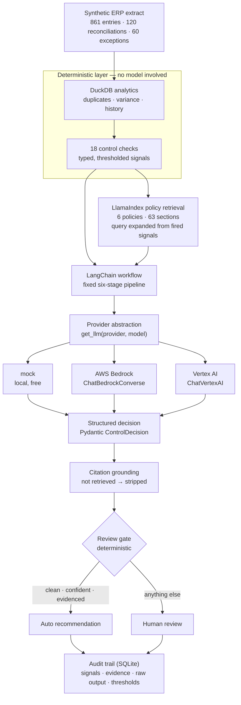

# Finance Close Control Agent

An evidence-based, auditable control assistant for month-end close exceptions, portable across enterprise model providers.

---

## Why this exists

Every month, a group finance function raises more close exceptions than it has reviewer hours: unsupported manual
entries, late postings, reconciliation differences, suspected duplicates, postings to high-risk accounts. Most are
benign. A few are not. The scarce resource is not analysis — it is the attention of the people qualified to decide.

Triage is therefore an obvious candidate for automation, and an obviously dangerous one. A control process has
requirements that a helpful summary does not meet: the same checks must run on every item, the reasoning must rest on
a policy someone can open and read, high-risk items must reach a person regardless of how confident the software is,
and six months later an auditor must be able to reconstruct what the system knew when it made a recommendation.

This project explores a narrower question than "can AI do finance": **can a finance-control workflow stay
evidence-based, auditable and portable across enterprise model providers?** It is a prototype built to be discussed,
challenged, and — where it falls short — to say clearly where.

## What it does

For one close exception, the system:

1. runs 18 deterministic control checks over the ledger in DuckDB (materiality, approval, segregation of duties,
   timeliness, duplicates, reconciliation status, variance, …);
2. retrieves the governing policy sections through LlamaIndex, with document, section and chunk id preserved;
3. asks a language model — reached through a provider abstraction, not an SDK — to classify, rate and recommend,
   returning a validated Pydantic object rather than prose;
4. checks every citation the model made against what was actually retrieved, and strips the ones that were not;
5. applies a deterministic review gate that decides whether a person must look at the case;
6. writes an audit record from which the whole decision can be reconstructed.

It never posts, reverses or modifies a ledger entry. It recommends; a named person decides.

## Architecture



The load-bearing idea is the boundary inside that diagram. Everything before the model is deterministic and
reproducible; the model interprets facts it did not compute, against policy it did not choose, and its output is
constrained, grounded and gated on the way out.

## Example

```
$ fcca run-case --exception EXC-0001 --provider mock

Exception EXC-0001  ·  missing supporting documentation  ·  NL30  ·  period 2026-07
Manual journal entry above group materiality posted without a supporting document reference.

 journal entry  JE-202607-X0001   SA
       account  600000  Personnel expenses
   cost center  CC-1000
        amount  EUR 434,538.11
        posted  2026-07-15 16:29 by u.jansen
 document date  2026-07-15  (0 days to post)
       support  none
      approver  u.devries
reconciliation  not_applicable

Deterministic controls — 4 of 18 triggered
check                            severity  observed      detail
CHK-01 supporting_documentation  CRITICAL  none          Manual posting carries no supporting document reference;
                                                         amount is at or above the clearly trivial threshold.
CHK-09 narrative_quality         WARNING   As discussed  Description does not allow an independent reviewer to
                                                         understand the business event.
CHK-13 materiality_assessment    CRITICAL  434538.11     At or above group materiality; reportable to Group
                                                         Accounting. Band: material.
CHK-17 account_variance          WARNING   447791.31     Account movement of 447,791 reporting currency (858.9%)
                                                         versus the prior-period average exceeds the variance
                                                         escalation trigger.

Risk        HIGH    confidence 0.87    classification missing_supporting_documentation
Finding     Missing supporting documentation: supporting documentation breached and 3 further indicator(s).
Action      Escalate to the entity Financial Controller before entity sign-off.
Disposition HUMAN REVIEW REQUIRED
  · Deterministic mandatory escalation trigger(s): CHK-01 supporting_documentation; CHK-13 materiality_assessment
  · Risk rated high; policy reserves high-rated items for human review.
  · Recommended action 'escalate_to_financial_controller' requires a named person to act.

Policy evidence
  > Supporting Documentation Standard §4.2 Escalation   relevance 1.00   policies/supporting_documentation_standard.md
  > Supporting Documentation Standard §4.1 Standard treatment   relevance 0.87
    Materiality and Escalation Policy §3.3 Variance escalation   relevance 0.74
    Journal Entry Policy §3. Documentation requirement   relevance 0.61

mock:deterministic-stub-v1  ·  1 parse attempt(s)  ·  mode json_schema_prompt  ·  prompt 2b5c4bd71a89
```

`>` marks the sections the decision actually cited. Everything shown here is also written to the audit trail.

## Multi-cloud design

Nothing in the workflow imports a cloud SDK. One factory returns a `BaseChatModel`:

```python
from fcca.providers import get_llm

model = get_llm(provider="bedrock", model_name="eu.anthropic.claude-sonnet-4-5-20250929-v1:0")
model = get_llm(provider="vertex", model_name="gemini-2.5-flash")
model = get_llm(provider="mock")  # local, deterministic, free
```

No model id appears anywhere outside [`src/fcca/config.py`](src/fcca/config.py). Bedrock uses
`ChatBedrockConverse` — the Converse API rather than a model-specific invoke API — so changing `BEDROCK_MODEL_ID`
from an Anthropic model to a Nova, Llama or Mistral model changes no code. Vertex uses `ChatVertexAI`. Both are
optional installs; neither is needed to run, test or demonstrate the project.

Why this matters outside an architecture diagram: enterprise model access is decided by procurement, data residency
and an existing cloud agreement, not by the engineering team. A finance workflow that can only run on one provider may
not be deployable at all. The portability claim here is enforced by a test
([`tests/test_workflow.py`](tests/test_workflow.py)) that runs the entire pipeline against a second, unrelated chat
model and asserts the behaviour is unchanged.

Structured output has two modes, both producing a validated `ControlDecision`: `json_schema_prompt` (default,
identical on every provider) and `native_tools` (delegates to the provider's own structured-output API). The portable
one is the default deliberately — a prototype that only works where tool calling is good has not demonstrated
portability.

## Auditability and human review

**Grounding.** The model may cite only from the list of retrieved sections supplied with the case, and it never
supplies policy text — passages come from the retriever. Citations are matched against what was retrieved; unmatched
ones are stripped from the decision and recorded as ungrounded. That turns "the system cited a policy" into "the
recommendation is traceable to a passage a reviewer can open".

**The gate is deterministic and it always wins.** Auto-recommendation requires *all* of: no mandatory escalation
trigger, risk not `high`, confidence at or above threshold, enough grounded evidence, no ungrounded citations, and a
remediation that carries no external consequence. Everything else is an explicit `human_review` state with the reasons
recorded. A model that is certain an unsupported material entry is fine cannot clear it — the control layer overrides
the model, not the other way round. A case the system *fails* on is not a pass either: it becomes a human-review item
with the failure logged.

**Reconstruction.** `fcca audit --exception EXC-0001` returns everything the decision rested on:

```json
{
  "exception_id": "EXC-0001", "status": "decided",
  "provider": "mock", "model": "deterministic-stub-v1",
  "structured_output_mode": "json_schema_prompt", "code_revision": "a1b2c3d",
  "confidence": 0.87, "human_review_required": 1, "parse_attempts": 1,
  "prompt_sha256": "2b5c4bd71a893be5ccf44ea80d6f6087",
  "deterministic_checks": "… 18 signals with observed values and thresholds …",
  "policy_evidence": [
    {"document": "Supporting Documentation Standard", "section": "4.2 Escalation",
     "node_id": "pol-a0e5377dc28c", "score": 1.0, "passage_sha256": "2468f9048a52120d"}
  ],
  "llm_raw_output": "… the unvalidated response, kept alongside the validated decision …",
  "gate": {"disposition": "human_review", "reasons": ["…"]},
  "settings_snapshot": {"materiality_group": 250000.0, "journal_approval_threshold": 50000.0,
                        "auto_approve_min_confidence": 0.8}
}
```

The thresholds in force are stored with each decision, so a recommendation can be reread against the policy
configuration of the month it was made. Credentials never appear: only a non-secret settings snapshot is persisted,
and a test asserts it. `fcca review --exception EXC-0001 --action approved --reviewer u.klein` closes the loop by
appending the human disposition to the same record.

## Security and governance

- **Credentials never enter the project.** AWS uses its standard credential chain, Vertex uses Application Default
  Credentials. Nothing here reads, stores, prints or logs a key, and `.env` is git-ignored.
- **Only a non-secret settings snapshot is persisted.** A test asserts no audit field name matches
  `key|secret|token|password|credential`.
- **Minimum necessary context leaves the boundary.** One entry, its 18 control signals, the retrieved passages. No
  unrelated postings, no counterparty master data, no customer records — and the exact payload is reproduced in the
  audit trail, so what was sent is not a matter of trust.
- **Synthetic data only.** No real entity, account, employee or amount appears in this repository.
- **Retrieved text is data, not instruction.** Policy passages and free-text entry descriptions are treated as
  untrusted input. The defence is layered: the output vocabulary is closed, there is no write path in the codebase,
  and the escalation gate never reads model output — so a successful injection cannot clear a flagged item. The system
  prompt also says to ignore embedded instructions, which is the weakest of the three and listed last for that reason.
- **Tool capability is bounded.** Six typed, read-only tools. None of them writes anywhere.
- **Provider and model are recorded per decision**, alongside the code revision and the thresholds in force — a model
  change is a change to a control, and the record shows which one made each recommendation.
- **No compliance claim.** This is a prototype. Nothing here is certified against SOX, ISAE, ISO or GDPR, and
  [`docs/architecture.md`](docs/architecture.md) §10 lists what would have to change before it went near a real
  ledger.

## Evaluation

60 labelled exceptions across 20 scenarios, spanning all three risk ratings and both dispositions. Labels are ground
truth **by construction** — each exception is generated from a named scenario whose expected outcome follows from the
policy set — not human annotations of production data. That is a real limitation, stated here rather than buried.

```bash
python -m fcca.evaluate --provider mock
python -m fcca.evaluate --compare
```

Current [`results/benchmark.csv`](results/benchmark.csv):

| provider | model | status | cases | risk acc | action acc | esc prec | esc rec | cite acc | valid out | p50 | cost/case |
|---|---|---|---|---|---|---|---|---|---|---|---|
| mock | deterministic-stub-v1 | ok | 60 | 1.00 | 0.90 | 1.00 | 1.00 | 0.95 | 1.00 | 0 ms | — |
| **bedrock** | **claude-haiku-4-5 (eu)** | **ok** | **60** | **0.70** | **0.62** | **0.81** | **1.00** | **0.98** | **1.00** | **4.9 s** | **$0.005** |
| **bedrock** | **claude-sonnet-4-5 (eu)** | **ok** | **60** | **0.87** | **0.63** | **0.87** | **1.00** | **0.97** | **1.00** | **8.7 s** | **$0.016** |
| vertex | *(configurable)* | **not_run** | not_run | not_run | not_run | not_run | not_run | not_run | not_run | not_run | not_run |

Both Bedrock rows are real runs over the same 60 cases in eu-central-1, differing only in
`BEDROCK_MODEL_ID`. No code changed between them — which is the portability claim, measured rather
than asserted. Vertex still reads `not_run` because nobody has run it, and no cell in that row is
estimated.

**Reading it.** The mock scores 1.00 on risk because it *is* the labelling rubric expressed in
Python; that row measures pipeline integrity, not model quality. The two live rows are where the
architecture is either doing its job or not:

- **Neither model missed an escalation.** `fn = 0` on both, recall 1.00. Not because both models
  were right, but because the deterministic gate forces review on a mandatory trigger and never
  consults the model about it. That is the single property the design exists to guarantee, and it
  survived a threefold drop in model price.
- **Judgement degrades with model capability, and only judgement does.** Haiku rates risk correctly
  on 70% of cases against Sonnet's 87%, and clears only 1 of the 12 benign items where Sonnet
  clears 5 (`fp` 11 versus 7). The cheaper model is noisier for reviewers; it is not less safe.
- **The mechanical properties held identically.** Structured output valid on every case for both,
  zero ungrounded citations for both, citation accuracy 0.98 and 0.97. Schema validation and
  citation grounding are code, so model choice does not move them.
- **The buying decision follows from the table.** Haiku costs a third and answers in half the time.
  If the deliverable is "nothing reaches sign-off unreviewed", it is sufficient. Sonnet is what you
  pay for to cut reviewer noise — four fewer false escalations per sixty exceptions.
- **Action-category accuracy is ~0.62 on both and is one behaviour, not noise.** Both models
  escalate where the labels expect a specific remedy — `route_to_reviewer` for an unapproved entry,
  `propose_correcting_entry` for a duplicate. Deliberately not fixed: tuning a prompt against labels
  this repository wrote itself would raise the number and prove nothing.


Regenerate with `python -m fcca.figure --provider bedrock --model <id>`. It reads the recorded run
rather than taking numbers as arguments, so the picture cannot drift from the table above it.

**How much does one run move?** Sonnet was run twice over the same 60 cases at temperature 0.
**One case of sixty changed.** Risk accuracy, action accuracy, citation accuracy, escalation recall
and structured-output validity were identical to four decimals; escalation precision moved 0.873 to
0.857, because a single benign item that was cleared in the first pass was escalated in the second.
`fn` stayed at 0 in both.

That is a stability figure, not a guarantee — two passes bound nothing tightly, and the one case
that moved is exactly the kind that sits near a boundary. It is worth stating because the direction
matters: the flip added review rather than removing it. Both passes are kept in `results/`; the
comparison table shows the most recent per model.

**On the labels.** They are ground truth by construction, so a disagreement is not automatically a
model error. Whether an uncleared duplicate should be routed for a correcting entry or escalated
outright is a matter a real controller would rule on, and this repository is not that controller.

Metrics collected: risk accuracy, action-category accuracy, escalation precision / recall / F1, retrieval recall
(did the retriever surface the governing document?) reported separately from citation accuracy (did the decision cite
it?), structured-output validity, ungrounded-citation rate, unsupported-recommendation rate, latency percentiles, and
cost per case when the provider reports token usage and prices are configured. Escalation recall and precision are the
two that matter operationally: recall is missed escalations, precision is wasted reviewer time. The metric functions
are tested against deliberately wrong answers, not only correct ones.

## Run it locally

No cloud account, no API key, no cost.

```bash
git clone https://github.com/morichtereur/finance-close-control-agent
cd finance-close-control-agent
python -m venv .venv && source .venv/bin/activate
pip install -e ".[dev]"

python -m fcca.generate_data        # seeded synthetic ledger + labelled exception set
python -m fcca.ingest_policies      # chunk and index the policy knowledge base
python -m fcca.run_case --exception EXC-0001 --provider mock
python -m fcca.evaluate --provider mock
python -m fcca.cli audit --exception EXC-0001
```

Requires Python 3.12+. Every command is also available as `fcca <subcommand>` after installation, and `fcca info`
prints the active provider, thresholds, dataset shape and index size.

## Run it on AWS Bedrock

```bash
pip install -e ".[bedrock]"
aws sso login                        # or any standard AWS credential source
export LLM_PROVIDER=bedrock
export AWS_REGION=eu-central-1
export BEDROCK_MODEL_ID=eu.anthropic.claude-sonnet-4-5-20250929-v1:0
python -m fcca.run_case --exception EXC-0001
python -m fcca.evaluate --provider bedrock
```

Any chat model enabled in your account works. Serverless models are enabled on first invocation;
Anthropic models may require a one-time use-case form. In EU regions an inference-profile id
(`eu.anthropic.…`) is required rather than the bare model id.

Authentication uses the standard AWS credential chain, so a Bedrock API key works too — export it
as `AWS_BEARER_TOKEN_BEDROCK` and botocore prefers bearer auth automatically, with no access keys
involved. Note that a *short-term* Bedrock key expires after a few hours and then fails with
"Signature expired"; generate a long-term one for anything that has to keep working. This project
never reads, stores or logs a key either way.

## Run it on Google Vertex AI

```bash
pip install -e ".[vertex]"
gcloud auth application-default login
export LLM_PROVIDER=vertex
export GOOGLE_CLOUD_PROJECT=your-project-id
export VERTEX_LOCATION=europe-west4
export VERTEX_MODEL_NAME=gemini-2.5-flash
python -m fcca.evaluate --provider vertex
```

Authentication uses Application Default Credentials or an attached service account.

Note that `ChatVertexAI` is deprecated as of `langchain-google-vertexai` 3.2.0 in favour of
`ChatGoogleGenerativeAI`, with removal due in 4.0.0. The adapter has not been switched: the two
authenticate differently, and exchanging one never-executed adapter for another only relocates the
untested surface. That migration belongs with the first live Vertex run, where it can be verified
in the same pass — which is also when this row stops reading `not_run`.

## Tests

```bash
pytest          # 107 tests, mock provider only, no network calls
ruff check .
mypy
```

Coverage spans the finance rules at their thresholds, retrieval (does the right section come back?), structured-output
validation and its failure modes, the review gate including the deterministic override, provider substitution, audit
completeness and secret-freedom, evaluation metrics against wrong answers, and data-generation reproducibility.

## Repository structure

```
policies/            six illustrative finance policies — the RAG knowledge base
src/fcca/
  config.py          every threshold, path and model id; nothing hard-coded elsewhere
  models.py          Pydantic contracts: facts, signals, decisions, evidence
  masterdata.py      synthetic entities, accounts, cost centres, users
  generate_data.py   seeded generator: ledger, reconciliations, exceptions, labels
  analytics.py       DuckDB queries — duplicates, variance, history, reconciliations
  controls/          18 deterministic checks (materiality, journal, reconciliation)
  retrieval/         LlamaIndex index build + retriever with source attribution
  providers/         get_llm factory · mock · bedrock · vertex
  workflow/          LangChain pipeline, prompts, structured output, grounding, gate, tools
  audit/             SQLite decision log and reconstruction
  evaluation/        metrics and the multi-provider benchmark
  cli.py             fcca generate-data | ingest-policies | run-case | evaluate | audit | review | info
tests/               107 tests, mock provider only
docs/                architecture.md · portfolio-copy.md
results/             benchmark.csv and per-provider run detail
```

## Design decisions worth arguing with

**Retrieval is lexical (BM25), not embeddings.** The corpus is six short, controlled, jargon-dense documents where the
decisive tokens are exact — *materiality*, *suspense*, *segregation*, *50,000*. Lexical matching handles those
precisely, needs no embedding provider (so the repository runs free), and is deterministic, which makes retrieval
itself unit-testable and the audit trail reproducible. The retriever is a LlamaIndex `BaseRetriever`, so a vector or
hybrid index is a constructor change in one module. On a corpus of 500 policies across a group's jurisdictions that
swap is the right call — at six, it would be complexity without benefit.

**Tools exist but no agent drives them.** The capabilities are real typed LangChain tools (`calculate_materiality`,
`retrieve_policy`, `get_account_risk`, …), invoked deterministically by the orchestrator. In a close, the sequence of
checks *is* the control design: every exception must receive the same checks in the same order, or the population is
no longer comparable and the close is not auditable. An agent that plans its own path produces a different audit trail
for every case. LangGraph was considered and left out — the workflow has no cycles, no branching state machine and no
need for one.

**The policy documents do not drive the thresholds.** Retrieved policy text informs the model's reasoning; the numeric
thresholds live in configuration. Parsing enforceable limits out of prose would be the more impressive demo and the
worse control: a control threshold must be explicit, versioned and testable. The cost is that a policy edit and a
configuration change have to be made together, which is honest about what would need governance in production.

## Limitations

- **Synthetic data.** No real entity, account, employee, amount or policy appears anywhere in this repository. The
  policies are illustrative documents written for the prototype, not accounting guidance.
- **Labels are ground truth by construction**, derived from the scenario definitions, not from human review of
  production exceptions. They validate the pipeline, not the finance judgement.
- **Mock results measure the harness, not a model.** See the evaluation section.
- **Bedrock has been run on two models; Vertex has not been run at all.** Sonnet was run twice and moved one case of
  sixty, which bounds run-to-run drift loosely rather than establishing a confidence interval — two passes is not a
  sample. Haiku was run once. The Vertex adapter is implemented and its row reads `not_run` until someone runs it
  with their own project.
- **Prototype, not production.** No authentication, no multi-tenancy, no ERP integration, no retention policy, no
  monitoring, no change control over the policy corpus. [`docs/architecture.md`](docs/architecture.md) lists what
  would have to change first.
- **Decision support only.** Nothing here posts to a ledger, and no path in the code can. It is not financial,
  accounting or audit advice.
- **Not certified against anything.** No SOX, ISAE, ISO or GDPR claim is made or implied.

## Licence

MIT. See [`docs/architecture.md`](docs/architecture.md) for the design rationale and
[`docs/portfolio-copy.md`](docs/portfolio-copy.md) for a short case-study write-up.
