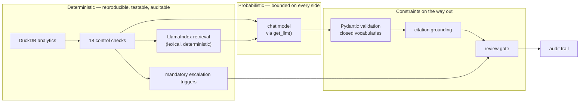

# Architecture

This document explains the decisions behind the code: where the boundaries are, why each framework is present, what
is logged, what is trusted, and what would have to change before anything like this ran near a real ledger.

## 1. The one decision everything else follows from

A finance control is not an answer. It is a *reproducible procedure that produces evidence*. Two people running the
same control over the same population must reach the same result, and an auditor arriving six months later must be
able to see what was checked, against which threshold, and on what basis.

Language models are not reproducible procedures. They are very good at the part of the work that is genuinely
interpretive: reading a policy paragraph, relating it to a specific fact pattern, and expressing a recommendation in
the language the organisation uses.

So the system is split along that line:

| | Deterministic layer | Probabilistic layer |
|---|---|---|
| What it does | measures, thresholds, compares, aggregates | interprets, classifies, recommends, explains |
| Implemented with | Python + DuckDB | a chat model behind an abstraction |
| Reproducible | yes, exactly | no |
| Can it clear an item? | it can *force* review | never |
| Failure mode | wrong threshold — visible, testable | plausible wrong reasoning — invisible |

The model never computes a number that matters. It never sees an amount without the control context a reviewer would
apply. It never decides whether something reaches a person — the gate does. It never supplies policy text — the
retriever does. What it contributes is judgement over facts it was given, in a shape the organisation can route.



Note the two arrows into the gate. The gate reads the model's decision *and* the deterministic triggers, and the
triggers win. That is the whole safety argument in one edge.

## 2. Why LangChain

For one thing only: a single `BaseChatModel` interface with composable, named steps underneath it.

The pipeline is six `RunnableLambda` stages composed with `|`. That buys a named, traceable sequence, a uniform
invocation and streaming surface, and — the point — the ability to substitute Bedrock, Vertex AI or a local stub with
no branch anywhere in the workflow. `with_structured_output` is available when a provider supports native structured
output, and the portable schema-in-prompt path is used by default.

What LangChain is *not* doing here: planning, tool selection, memory, or retrieval. Those would be the reasons to
reach for an agent framework, and this problem does not want an agent (§4).

LangGraph was evaluated and rejected. It earns its complexity when there are cycles, branching state machines,
interrupts or checkpointed long-running processes. This workflow is a straight line with one deterministic decision at
the end. Adding a graph runtime would have made the repository look more sophisticated and the system harder to
explain to the person who has to sign the close.

## 3. Why LlamaIndex

Because policy passages have to be *addressable*. A recommendation is only defensible if a reviewer can open the
exact section it rests on.

LlamaIndex provides the document/node model, section-aware parsing, metadata that survives chunking, a persisted
docstore and a retriever interface. The pipeline is: markdown file → `Document` with title and source path →
section-aware split on numbered headings → `SentenceSplitter` only for sections too long to keep whole → `TextNode`
carrying `document`, `section`, `source_path`, `chunk_index` → persisted `SimpleDocumentStore` plus a manifest with a
SHA-256 per policy document.

Splitting on headings first is not cosmetic. A generic character splitter will cut *"entries at or above EUR 50,000
require documented second-level approval"* in half, and a citation to a mid-sentence chunk is useless to a reviewer.
Every node inherits a real, quotable reference such as *Journal Entry Policy §4.2*.

**Retrieval is lexical (Okapi BM25), implemented in ~30 lines inside a LlamaIndex `BaseRetriever`.** The reasoning is
in the README; the engineering consequence is that retrieval is deterministic, unit-testable, free to run and adds no
compiled dependency. Swapping in a vector index — with a Bedrock or Vertex embedding model, which would also make
retrieval provider-portable — is a constructor change in `retrieval/retriever.py` and touches nothing downstream.

One non-obvious piece: **the query is not the exception text.** It is expanded from the deterministic signals that
fired. Each check id maps to policy vocabulary (`CHK-16` → *"suspense clearing account cleared zero month-end residual
balance"*), so retrieval is anchored to what the controls actually found rather than to whatever words the preparer
happened to type in the description field. That is a structured-to-lexical bridge, and it is why retrieval recall is
high on a corpus where the free-text descriptions are deliberately uninformative.

## 4. Why there is no autonomous agent

The capabilities are exposed as real, typed LangChain tools — `calculate_materiality`, `retrieve_policy`,
`get_account_risk`, `check_document_support`, `check_reconciliation_status`, `calculate_variance`. They are invoked by
the orchestrator in a fixed order, not chosen by a model.

In a month-end close, **the sequence of checks is the control design.** Every exception in the population must receive
the same checks in the same order. If the system decides per case which controls to run:

- the population is no longer comparable, so exception statistics mean nothing;
- the audit trail differs for every item, so "what did the system check?" has no stable answer;
- a missed check is invisible — nothing distinguishes "the control passed" from "the control never ran";
- the failure mode is silent and correlated with exactly the unusual cases that most need checking.

They are defined as tools anyway because it costs nothing, makes the capability surface explicit and typed, and is the
natural seam if a future version wants a model-driven step for a bounded sub-problem (for example, drafting the
narrative request sent to a preparer).

## 5. Why the provider is abstracted

Three reasons, in increasing order of how much they matter to the organisation:

1. **Engineering.** Model ids, regions and parameters live in one settings object. Nothing downstream knows a cloud
   exists.
2. **Evaluation.** Comparing providers requires holding everything else constant. Because prompt construction,
   retrieval, parsing, grounding and gating are shared, a benchmark difference is attributable to the model.
3. **Deployability.** Enterprise model access is decided by procurement, data residency and an existing cloud
   agreement — not by the engineering team, and not permanently. A finance workflow that only runs on one provider
   may not be deployable at all, and will have to be rewritten when the agreement changes.

The abstraction is one factory and three adapters. `get_llm(provider, model_name)` returns a `BaseChatModel`; cloud
SDKs are imported lazily inside their adapters, so installing without the extras leaves the mock path fully
functional. Cloud SDK exceptions are re-typed at the boundary into `ProviderError` / `ProviderNotInstalledError` /
`ConfigurationError`, so no caller needs to import `botocore` or `google.api_core` to handle a failure.

The mock provider is a real `BaseChatModel`, not a patched-out function. The whole pipeline — prompt, parser,
grounding, gate, audit — runs identically against it. That is what makes the portability test meaningful and CI free.

## 6. Trust boundaries

| Boundary | What crosses it | How it is constrained |
|---|---|---|
| ERP extract → controls | ledger rows | validated into frozen Pydantic models; account numbers forced to strings |
| Controls → model | 18 signals, one entry, thresholds | minimum necessary context; no unrelated postings, no counterparty master data |
| Policy corpus → model | retrieved passages | treated as untrusted data, not instruction (see below) |
| Model → workflow | one JSON object | closed vocabularies, range-checked confidence, cross-field validation |
| Model → evidence | citations only | may name document + section, never supply passage text; grounded against retrieval |
| Workflow → ledger | **nothing** | there is no write path in the codebase |

**Prompt injection.** Retrieved policy passages and free-text entry descriptions are attacker-influenceable in any
real deployment — a preparer types the description, and a policy corpus is edited by many hands. Three mitigations,
in order of how much they actually help:

1. *Blast radius.* The output vocabulary is closed and the system has no write capability. The worst a successful
   injection achieves is a wrong recommendation on one case — which then meets the gate.
2. *The gate is not model-controlled.* An injected instruction cannot clear an item that a deterministic trigger
   flagged, because the gate never reads model output for that decision.
3. *Instruction.* The system prompt states that passages and descriptions are reference data and that instructions
   inside them must be ignored. Listed last on purpose: it is the weakest of the three, and a design that relied on
   it would be a bad design.

## 7. What is logged

Every case, decided or failed, appends one row to SQLite:

`timestamp · exception_id · journal_id · status · provider · model · structured_output_mode · package_version ·
code_revision (git sha) · deterministic_checks (all 18, with observed values and thresholds) · policy_evidence (with
node ids, relevance scores and a SHA-256 per passage) · llm_raw_output (unvalidated) · validated_decision · grounding
report · gate outcome and reasons · confidence · human_review_required · latency_ms · parse_attempts · input/output
tokens where reported · estimated_cost_usd where prices are configured · prompt_sha256 · settings_snapshot`

Three of those are less obvious and carry most of the value:

- **`settings_snapshot`** — the thresholds in force at decision time. Without it, rereading an old recommendation
  against today's materiality is meaningless.
- **`llm_raw_output`** — what the model actually said, before validation. If validation stripped something, the
  reviewer can see what.
- **`passage_sha256`** — proof the cited policy text has not changed since the decision was made.

Human dispositions are appended to a second table, so `reconstruct(exception_id)` returns the machine recommendation
and the human decision together.

**What is never logged:** credentials, environment variables, or any configuration value that could carry a secret.
Only `Settings.public_snapshot()` is persisted, and a test asserts that no key in it matches `key|secret|token|
password|credential`.

## 8. The review gate

Auto-recommendation requires **all** of:

```
no deterministic mandatory-escalation trigger
AND risk_level != "high"
AND confidence >= FCCA_AUTO_APPROVE_MIN_CONFIDENCE
AND grounded_citations >= FCCA_AUTO_APPROVE_MIN_EVIDENCE
AND no ungrounded citations
AND action_category not in {escalate_to_financial_controller, propose_correcting_entry, refer_to_internal_audit}
```

Anything else produces `human_review` with the reasons recorded. Two properties worth stating explicitly:

- **A failure is not a pass.** If the model returns unparseable output twice, the case becomes a human-review item
  with the error logged — never a silent skip and never an implicit clearance.
- **"Auto" is narrow.** It means *a recommendation applied without a second pair of eyes*. It has never meant a
  posting: no path in this system writes to a ledger.

## 9. Evaluation design

The labelled set is generated, not curated: each of 60 exceptions comes from one of 20 named scenarios whose expected
risk rating, review requirement, remediation category and governing policy follow from the policy set. This makes the
labels reproducible and the rubric explicit — and makes them ground truth *by construction*, which validates the
pipeline rather than the finance judgement. Real validation would require a controller reviewing real exceptions.

Two deliberate choices:

- **Retrieval recall is reported separately from citation accuracy.** If the decision fails to cite the governing
  document, that split says whether the retriever never surfaced it or the model ignored it. One number would hide
  which layer to fix.
- **Failures count against the run.** A case with no valid decision counts as a wrong risk rating and as an
  escalation. Dropping unparseable cases would make a fragile model look good.

The metric functions are unit-tested against deliberately wrong answers — missed escalations, over-escalation, wrong
ratings, unsupported recommendations — because a scoring function that has only ever seen correct input is not
evidence of anything.

## 10. What would have to change before production

Not a roadmap. An honest list of what is missing, roughly in the order it would block a deployment.

**Data and integration**
- Real ERP extraction (SAP/Oracle) with reconciled control totals, incremental loading and a documented cut-off.
- Entity-specific materiality and calendars instead of one group threshold.
- FX at actual rates with a documented source, replacing the static table.

**Governance**
- Change control over the policy corpus: versioned documents, an approver, and decisions pinned to a policy version.
  Today a policy edit silently changes future retrieval. The manifest hashes are the hook; the process is missing.
- The threshold/policy duality (§ README) needs an owner and a review, since a policy edit and a configuration change
  must move together.
- Documented model change management: a provider or model change is a change to a control, and needs re-evaluation
  against the labelled set before it takes effect.

**Engineering**
- Authentication, authorisation and segregation of duties in the review interface — the reviewer identity is currently
  a CLI argument, which is fine for a prototype and unacceptable for a control.
- Append-only or tamper-evident audit storage. SQLite in a working directory is not an audit system; a real one needs
  write-once storage, retention aligned to statutory record-keeping, and export to the GRC platform.
- Rate limiting, retry with backoff, circuit breaking and cost caps on the provider calls.
- Monitoring: escalation rate by entity and scenario, model drift against the labelled set, structured-output failure
  rate, latency and spend.

**Evidence**
- Repeated benchmark runs rather than one pass per provider, so the spread between runs is known — a single run
  reports a point, and a control needs to know how much that point moves.
- Agreement rates against controller decisions on real exceptions, which is the validation the constructed labels
  cannot provide.
- A prospective study of whether reviewer time actually falls — the business case, which no amount of architecture
  substitutes for.

## 11. Testing strategy

107 tests, all on the mock provider, no network access, sub-second. Organised by the question each answers:

| File | Question |
|---|---|
| `test_controls.py` | Do the finance rules behave at their thresholds, and do only the right ones force escalation? |
| `test_retrieval.py` | Does the governing section come back, with a usable citation, deterministically? |
| `test_providers.py` | Can providers be described and substituted without credentials, and do failures stay typed? |
| `test_structured_output.py` | Do valid objects parse, and do invalid ones fail rather than degrade? |
| `test_grounding_and_gate.py` | Are invented citations stripped, and can a confident model override a control? |
| `test_workflow.py` | Does the whole pipeline behave, and behave identically on a different provider? |
| `test_audit.py` | Is the record complete, reconstructable and free of anything secret-shaped? |
| `test_evaluation.py` | Do the metrics detect wrong answers, and does an unrun provider stay `not_run`? |
| `test_data_and_cli.py` | Is generation reproducible, and does the CLI work end to end? |
